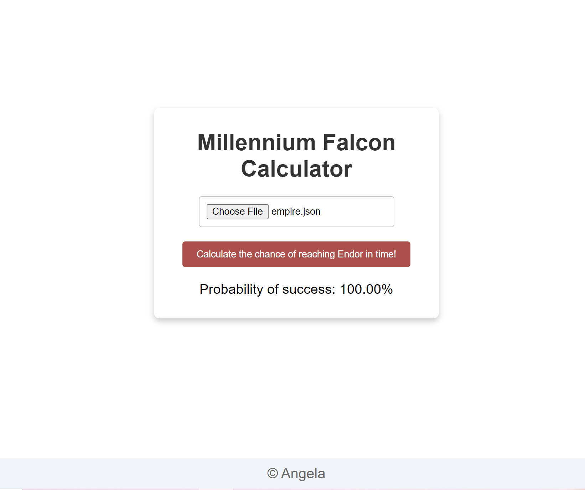

# Millennium Falcon Odds Calculator

This project is a single-page web application that calculates the probability that the Millennium Falcon will successfully reach **Endor** before the Empire's Death Star annihilates it. The application allows users to upload a JSON file containing intercepted data about the Empire's plans. 

## Features
- **File Upload**: Upload a JSON file containing the Empire's "countdown" and "bounty hunter" locations.
- **Probability Calculation**: Calculates the percentage of the Millennium Falcon successfully reaching Endor based on route and fuel constraints.
- **Web Interface**: Displays the probability of success in a simple  web interface.

## Project Structure

- **`dev/app.py`**: The main server-side script using Flask to handle the endpoint for calculating the probability.
- **`dev/templates/index.html`**: The HTML template for the web interface.
- **`dev/static/style.css`**: CSS file for styling the web page.
- **`data/millennium-falcon.json`**: Stores the specifications for the Millennium Falcon.
- **`data/empire.json`**: Stores the specifications for the bounty hunters.
- **`dev/utils.py`**: Includes helper functions for calculating the capture probability.
- **`tests/test_utils.py`**: Contains unit tests for the functions in `utils.py` to ensure their correctness and reliability.
- **`give-me-odds.py`**: A script that provides command-line functionality to calculate the odds based on the provided JSON files.
- **`give-me-odds.bat`**: A batch file to run the `give-me-odds.py` script conveniently on Windows systems.
- **`README.md`**: Project documentation.
- **`requirements.txt`**: List of dependencies for setting up the project environment.

## Getting Started

### Running the Application
To start the Flask app:
```bash
python app.py 
```
CLI 
```bash
python give-me-odds PathTo_millennium-falcon.json PathTo_empire.json
```


### Back-end

When it starts, the back-end service will read a JSON configuration file containing the autonomy, the path towards an SQLite database file containing all the routes, the name of the planet where the Millennium Falcon is currently parked (Tatooine) and the name of the planet that the empire wants to destroy (Endor).

**millennium-falcon.json**
```json
{
  "autonomy": 6,
  "departure": "Tatooine",
  "arrival": "Endor",
  "routes_db": "universe.db"
}
```
   - autonomy (integer): autonomy of the Millennium Falcon in days.
   - departure (string): Planet where the Millennium Falcon is on day 0.
   - arrival (string): Planet where the Millennium Falcon must be at or before countdown.
   - routes_db (string): Path toward a SQLite database file containing the routes. The path can be either absolute or relative to the location of the `millennium-falcon.json` file itself.

The SQLite database will contain a table named ROUTES. Each row in the table represents a space route. Routes can be travelled **in any direction** (from origin to destination or vice-versa).

   - ORIGIN (TEXT): Name of the origin planet. Cannot be null or empty.
   - DESTINATION (TEXT): Name of the destination planet. Cannot be null or empty.
   - TRAVEL_TIME (INTEGER): Number days needed to travel from one planet to the other. Must be strictly positive.

| ORIGIN   | DESTINATION | TRAVEL_TIME |
|----------|-------------|-------------|
| Tatooine | Dagobah     | 4           |
| Dagobah  | Endor       | 1           |

### Front-end

The front-end  consists of a single-page application offering users a way to upload a JSON file containing the data intercepted by the rebels about the plans of the Empire and displaying the odds (as a percentage) that the Millennium Falcon reaches Endor in time and saves the galaxy.



**empire.json**
```json
{
  "countdown": 6, 
  "bounty_hunters": [
    {"planet": "Tatooine", "day": 4 },
    {"planet": "Dagobah", "day": 5 }
  ]
}
```

   - countdown (integer): number of days before the Death Star annihilates Endor
   - bounty_hunters (list): list of all locations where Bounty Hunter are scheduled to be present.
      - planet (string): Name of the planet. It cannot be null or empty.
      - day (integer): Day the bounty hunters are on the planet. 0 represents the first day of the mission, i.e. today.


The web page will display the probability of success as a number ranging from 0 to 100%:
- `0%` if the Millennium Falcon cannot reach Endor before the Death Star annihilates Endor
- `x% (0 < x < 100)` if the Millennium Falcon can reach Endor before the Death Star annihilates Endor but might be captured by bounty hunters.
- `100%` if the Millennium Falcon can reach Endor before the Death Star annihilates Endor without crossing a planet with bounty hunters on it.

## Examples

### Example 1
**[universe.db](examples/example1/universe.db?raw=true)** (click to download)
| ORIGIN   | DESTINATION | TRAVEL_TIME |
|----------|-------------|-------------|
| Tatooine | Dagobah     | 6           |
| Dagobah  | Endor       | 4           |
| Dagobah  | Hoth        | 1           |
| Hoth     | Endor       | 1           |
| Tatooine | Hoth        | 6           |

**[millennium-falcon.json](examples/example1/millennium-falcon.json?raw=true)** (click to download)
```
{
  "autonomy": 6,
  "departure": "Tatooine",
  "arrival": "Endor",
  "routes_db": "universe.db"
}
```
**[empire.json](examples/example1/empire.json?raw=true)** (click to download)
```
{
  "countdown": 7, 
  "bounty_hunters": [
    {"planet": "Hoth", "day": 6 }, 
    {"planet": "Hoth", "day": 7 },
    {"planet": "Hoth", "day": 8 }
  ]
}
```

The application should display 0% as The Millennium Falcon cannot go from Tatooine to Endor in 7 days or less (the Millennium Falcon must refuel for 1 day on either Dagobah or Hoth).

### Example 2
**[universe.db](examples/example2/universe.db?raw=true)** same as above

**[millennium-falcon.json](examples/example2/millennium-falcon.json?raw=true)**: same as above

**[empire.json](examples/example2/empire.json?raw=true)** (click to download)
```
{
  "countdown": 8, 
  "bounty_hunters": [
    {"planet": "Hoth", "day": 6 }, 
    {"planet": "Hoth", "day": 7 },
    {"planet": "Hoth", "day": 8 }
  ]
}
```

The application should display 81% as The Millennium Falcon can go from Tatooine to Endor in 8 days with the following plan:
- Travel from Tatooine to Hoth, with 10% chance of being captured on day 6 on Hoth.
- Refuel on Hoth with 10% chance of being captured on day 7 on Hoth.
- Travel from Hoth to Endor

### Example 3
**[universe.db](examples/example3/universe.db?raw=true)** same as above

**[millennium-falcon.json](examples/example3/millennium-falcon.json?raw=true)**: same as above

**[empire.json](examples/example3/empire.json?raw=true)**
```
{
  "countdown": 9, 
  "bounty_hunters": [
    {"planet": "Hoth", "day": 6 }, 
    {"planet": "Hoth", "day": 7 },
    {"planet": "Hoth", "day": 8 }
  ]
}
```

The application should display 90% as The Millennium Falcon can go from Tatooine to Endor in 9 days with the following plan:
- Travel from Tatooine to Dagobath.
- Refuel on Dagobah
- Travel from Dagobah to Hoth, with 10% chance of being captured on day 8 on Hoth.
- Travel from Hoth to Endor

### Example 4
**[universe.db](examples/example4/universe.db?raw=true)** same as above

**[millennium-falcon.json](examples/example4/millennium-falcon.json?raw=true)**: same as above

**[empire.json](examples/example4/empire.json?raw=true)**
```
{
  "countdown": 10, 
  "bounty_hunters": [
    {"planet": "Hoth", "day": 6 }, 
    {"planet": "Hoth", "day": 7 },
    {"planet": "Hoth", "day": 8 }
  ]
}
```

The application should display 100% as The Millennium Falcon can go from Tatooine to Endor in 10 days and avoid Bounty Hunters with the following plans:
- Travel from Tatooine to Dagobah,  refuel on Dagobah
- Wait for 1 day on Dagobah
- Travel from Dagobah to Hoth
- Travel from Hoth to Endor


